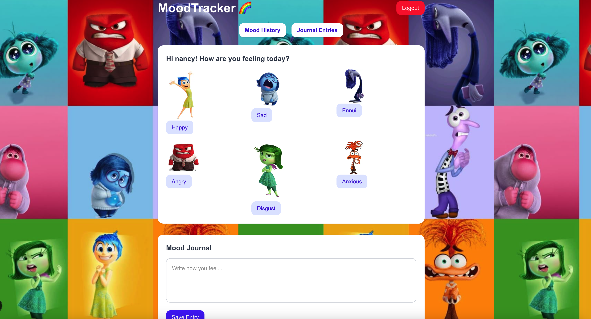

This is a [Next.js](https://nextjs.org) project bootstrapped with [`create-next-app`](https://nextjs.org/docs/pages/api-reference/create-next-app).



## Getting Started

First, run the development server:

```bash
npm run dev
# or
yarn dev
# or
pnpm dev
# or
bun dev
```

Open [http://localhost:3000](http://localhost:3000) with your browser to see the result.

You can start editing the project by modifying files inside the pages/ directory.
The page auto-updates as you edit the file.

`pages/index.js` — Home page where users can select mood and journal entries.
`pages/api/` — API routes for handling moods and journals (like addMood, moodHistory, etc).
`components/` — Reusable components like MoodEntries, MoodHistory, QuoteWindow.
`public/assets/` — Static files like images.

`Next.js` — React Framework

`TailwindCSS` — For beautiful, responsive UI

`[PostgreSQL / Prisma]` (if you're using) — Database for storing mood and journal entries

`[OpenAI API]` — To generate mood-based quotes
